# Eureka

**An AI system that builds reasoning — not just delivers answers.**

Eureka is a depth-adaptive, dignity-first AI tutoring platform. It continuously models each student's cognition through natural conversation — tracking reasoning style, abstraction comfort, curiosity, and where understanding breaks down — then teaches accordingly. It also gives teachers AI-powered tools to author structured learning modules, interactive simulations, and step-by-step animations, without writing code.

---

## Problem Statement

Most AI tutoring tools treat students as uniform recipients of information. They respond to questions with answers, but they do not pay attention to **how** a student thinks, where their reasoning fails, or how their confidence shifts across a conversation.

The consequences:

- **Depth mismatch.** Students at Level 2 abstraction receive Level 5 explanations.
- **No misconception detection.** Flawed mental models go unaddressed and compound.
- **Tone-deaf delivery.** A confused student receives the same response structure as a confident one.
- **Psychological friction.** Traditional correction patterns discourage risk-taking, which is the prerequisite for real learning.
- **No teacher agency.** Educators cannot shape what or how the AI teaches.

Eureka addresses each of these. Depth adapts per-student. Misconceptions are caught mid-conversation and redirected via Socratic sequences. Tone is computed across multiple axes using real-time cognitive signals. Every response passes through a dignity enforcement pipeline before delivery. And teachers can build complete learning modules using a visual creation pipeline backed by AI generation.

---

## Core Philosophy

**Depth-Adaptive Learning**
Understanding is not binary. Eureka operates on a 7-level depth scale — from intuitive analogy to formal mathematical rigor — and adjusts in real time based on how a student engages, not based on a preset difficulty curve.

**Psychological Safety**
Students learn best when the cost of being wrong is zero. Eureka enforces this programmatically: a multi-layer dignity system filters every outgoing response, removing condescension, validating effort, and ensuring that confusion is treated as signal, not failure.

**Dignity-First Design**
Before depth, before pedagogy, before any teaching strategy — dignity. The system scores, filters, and logs the psychological safety of every response. Content cannot be published unless it passes a dignity threshold.

**Socratic Scaffolding**
When a misconception is detected, Eureka does not correct it directly. It generates a targeted micro-question sequence designed to let the student discover the error themselves. Closure is adaptive: summary, analogy, or deeper challenge, depending on performance.

**Cross-Module Reasoning**
A question about circular motion might require understanding of force vectors from physics and trigonometry from mathematics. Eureka bridges modules without context switching, maintaining a unified cognitive profile across subjects.

---

## System Architecture Overview

```
                        Student / Teacher
                              |
                              v
                  +----------------------+
                  |   React Frontend     |
                  |   (Single-Page App)  |
                  +----------+-----------+
                             |
                        API Gateway
                             |
                             v
                  +----------------------+
                  |   FastAPI Backend     |
                  |   REST + SSE         |
                  +----------+-----------+
                             |
          +------------------+------------------+
          |                  |                  |
          v                  v                  v
   +-----------+     +-------------+    +-------------+
   | Teaching  |     |  Dashboard  |    |   Builder   |
   | Engine    |     |  Engine     |    |  Engine     |
   +-----------+     +-------------+    +-------------+
   | Module-   |     | Cross-module|    | Module Gen  |
   | bound     |     | reasoning   |    | Simulation  |
   | Socratic  |     | Cognitive   |    | Generation  |
   | teaching  |     | profiling   |    | Animation   |
   |           |     | Dignity     |    | Generation  |
   |           |     | enforcement |    |             |
   +-----------+     +-------------+    +-------------+
          |                  |                  |
          +------------------+------------------+
                             |
               +-------------+-------------+
               |             |             |
               v             v             v
          +--------+   +---------+   +-----------+
          |MongoDB |   | Azure   |   | Google    |
          |        |   | OpenAI  |   | Imagen 4  |
          |        |   | GPT-5.2 |   | Veo 3     |
          +--------+   | Azure   |   +-----------+
                        | Speech  |
                        +---------+
```

### Core Engine Components

**Dashboard Engine** — Multi-step cognitive pipeline for global chat

- Hybrid intent classification with fast-path optimization
- Real-time cognitive profiling with longitudinal tracking
- Misconception and challenge gating
- RAG-powered context retrieval
- Streaming response delivery with inline media generation

**Teaching Engine** — Module-bound structured learning

- Node-specific knowledge base integration
- Socratic micro-question sequences for misconception correction
- Depth-adaptive content delivery
- Energy and engagement detection

**Depth Controller** — Complexity regulation across 7 levels

- Automatic escalation and de-escalation based on student signals
- Smoothed reasoning quality tracking

**Tone Engine** — Multi-axis tone computation

- Psychological safety computed first — influences all other axes
- Depth-gated tonal adjustments

**Challenge Engine** — Controlled intellectual provocation

- Multi-gate activation to prevent overuse
- Engagement verification before challenge delivery

**Consistency Tracker** — Context-aware contradiction detection

- Domain and context-tagged claim tracking
- False-positive prevention through contextual matching

**Cognitive Profiler** — Long-term student modeling

- Tracks reasoning style, abstraction comfort, curiosity, precision, and challenge tolerance
- Smoothed updates for stable longitudinal profiles

**Dignity Pipeline** — Multi-layer response safety enforcement

- Content filtering, scoring, and confusion-triggered overrides
- Publish gate requiring minimum dignity threshold

---

## Dashboard Chat Architecture

The dashboard chat is a global-scope, cross-module reasoning system. It operates outside any specific learning module and can address questions across all subjects simultaneously.

```
User Message
     |
     v
Intent Classification (hybrid: rule-based + AI fallback)
     |
     v
Cognitive Profile Retrieval
     |
     v
Misconception & Challenge Gating
     |
     v
Context Retrieval (RAG)
     |
     v
AI Response Generation (SSE streaming)
     |
     v
Media Generation ([IMAGE:], [VIDEO:] tag interception)
     |
     v
Dignity Filtering (streaming, sentence-buffered)
     |
     v
Profile Update & Persistence
     |
     v
Client Rendering (LaTeX, Markdown, inline media)
```

Key capabilities:

- LaTeX equation rendering (KaTeX)
- Equation Builder and Chemistry Builder for structured input
- Complexity Slider (Levels 1-7) for student-controlled depth
- Voice input and neural text-to-speech
- AI-generated images and videos inline
- Conversation persistence with search

---

## Module System Architecture

Each learning module is a structured node graph representing a curriculum.

### Node Learning Experience

Each node delivers content through a multi-screen progressive-disclosure sequence with unlock gates — students must meaningfully engage before progressing. Gates include video watch percentage, scroll depth, answer selection, and interaction count thresholds.

### Concept Map

An interactive node graph visualization showing:

- Topic relationships and prerequisite chains
- Per-node mastery state (locked, available, in-progress, complete)
- Knowledge gaps and recommended next nodes

---

## Custom Module Builder

Teachers create structured learning modules through a three-phase AI-assisted pipeline.

```
Phase A: Intent & Metadata
  - 3-step wizard: scope, objectives, cognitive design
     |
     v
Phase B: Node Graph Generation
  - AI-generated DAG with visual editor
  - Add, remove, edit, and link nodes
  - DAG cycle validation
     |
     v
Phase C: Node Content Creation
  - Experience type and entry style selection
  - AI-generated content scaffolds
  - Per-block AI content generation
  - 7 block types: theory, example, practice, simulation, animation, quiz, summary
     |
     v
Preview & Publish
  - Depth-adaptive student preview
  - Multi-point validation including dignity threshold
```

Safeguards: The Tone Engine and Dignity Filter cannot be disabled during module creation. All generated content passes through dignity filtering before persistence.

---

## Simulation Builder

Teachers create interactive simulations through a structured pipeline.

```
Blueprint Wizard --> AI Engine Generation --> Configuration
     |                                           |
     v                                           v
Variable Definitions              Cognitive Guidance Generation
     |                                           |
     v                                           v
Interactive Preview (real-time equation evaluation)
     |
     v
Publish (model + renderer + guidance required)
```

**Six Renderer Types:** Graph, Animated Object, Numerical Display, Vector Field, Circuit Diagram, Grid Transform

**Cognitive Overlay:** Hypothesis prompts, observation prompts, misconception alerts, and exploration challenges during student interaction.

---

## Animation Builder

Teachers create Manim-style step-by-step animations through a 5-phase pipeline.

```
Blueprint Wizard --> Scene Designer --> Timeline Editor
                                            |
                                            v
                    Narration Layer --> Preview --> Publish
```

**Seven Animator Types:** Graph, Vector Field, Wave Propagation, Grid Transform, Particle Motion, Circuit Flow, Custom Drawing

**Depth-gated narration:** Plain clarity at lower depths, conceptual elegance at higher depths.

---

## Psychological Safety and Dignity Enforcement

Dignity enforcement is a multi-layer pipeline that processes every outgoing response.

**Layer 1 — Content Filtering:** Context-aware text processor that removes condescending language patterns while preserving code blocks, LaTeX, and media tags.

**Layer 2 — Safety Scoring:** Scores every response on a 0.0-1.0 psychological safety scale with penalty and reward indicators. Logged for longitudinal analysis.

**Layer 3 — Confusion Override:** Highest-priority fast-path activated when confusion is detected. Overrides system prompt to force simplest possible language.

**Publish Gate:** All teacher-created content must pass a dignity score threshold before publication.

---

## Tech Stack

### Frontend

| Technology           | Purpose                         |
| -------------------- | ------------------------------- |
| React 18             | Component architecture          |
| TypeScript 5.8       | Type safety                     |
| Vite 6               | Build tooling and dev server    |
| Tailwind CSS 3.4     | Utility-first styling           |
| Radix UI / shadcn    | Accessible component primitives |
| Framer Motion 11     | Animations and transitions      |
| TanStack React Query | Server state management         |
| KaTeX                | LaTeX math rendering            |
| mathjs               | Runtime equation evaluation     |
| Recharts             | Data visualization              |

### Backend

| Technology    | Purpose                        |
| ------------- | ------------------------------ |
| Python 3.12   | Runtime                        |
| FastAPI       | API framework                  |
| Uvicorn       | ASGI server                    |
| sse-starlette | Server-Sent Events (streaming) |
| httpx         | Async HTTP client              |
| PyMongo       | MongoDB driver                 |

### AI Services

| Service               | Purpose                           |
| --------------------- | --------------------------------- |
| Azure OpenAI GPT-5.2  | Reasoning, teaching, generation   |
| Azure Speech (Neural) | Text-to-speech with audio caching |
| Google Imagen 4 Ultra | On-demand image generation        |
| Google Veo 3          | On-demand video generation        |

### Database

MongoDB — primary data store for cognitive profiles, conversation state, learning progress, custom modules, simulations, animations, and analytics.

---

## Project Structure

```
eureka/
├── backend/
│   ├── main.py                  # FastAPI entry point
│   ├── requirements.txt
│   └── app/
│       ├── api/                 # Route handlers
│       ├── engine/              # Cognitive and generation engines
│       └── knowledge/           # Structured knowledge bases
├── src/
│   ├── pages/                   # Page components
│   ├── components/
│   │   ├── chat/                # Chat interface components
│   │   ├── concept-map/         # Node graph visualization
│   │   ├── module/              # Module builder components
│   │   ├── simulation/          # Simulation builder + renderers
│   │   ├── animation/           # Animation builder + animators
│   │   ├── screens/             # Learning screen components
│   │   ├── sidebar/             # Navigation
│   │   └── ui/                  # Base UI primitives
│   ├── hooks/                   # React hooks (streaming, CRUD, TTS)
│   ├── types/                   # TypeScript type definitions
│   └── lib/                     # Utilities
├── package.json
├── vite.config.js
└── tsconfig.json
```

---

## System Interface Overview

### 1. Dashboard landing and Chat

Global cross-module reasoning with adaptive depth and dignity enforcement.

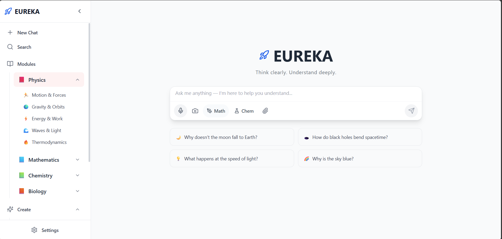
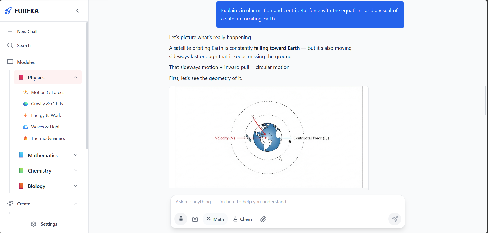
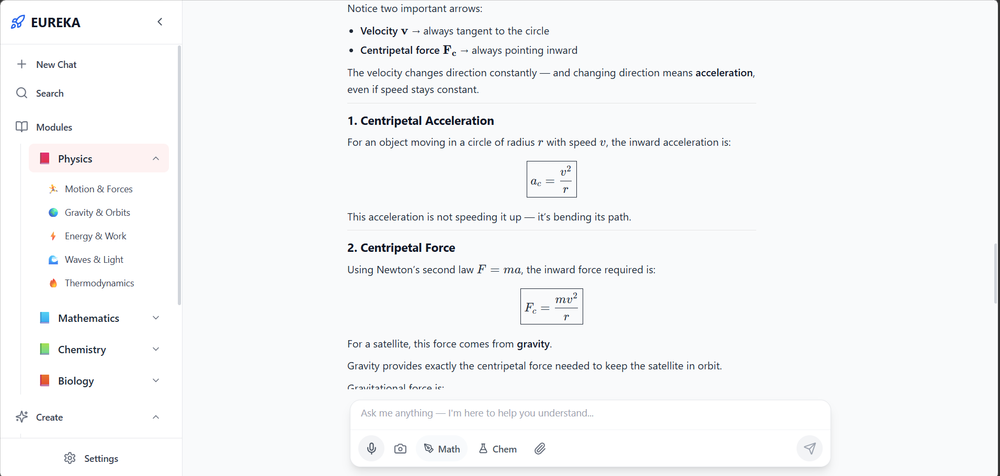
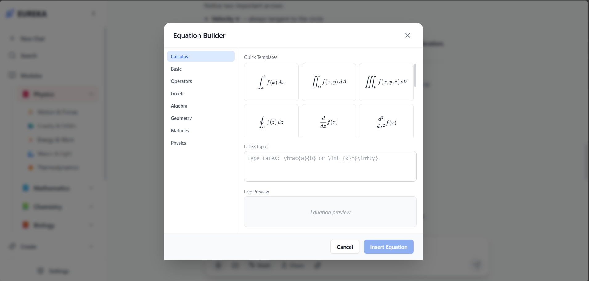
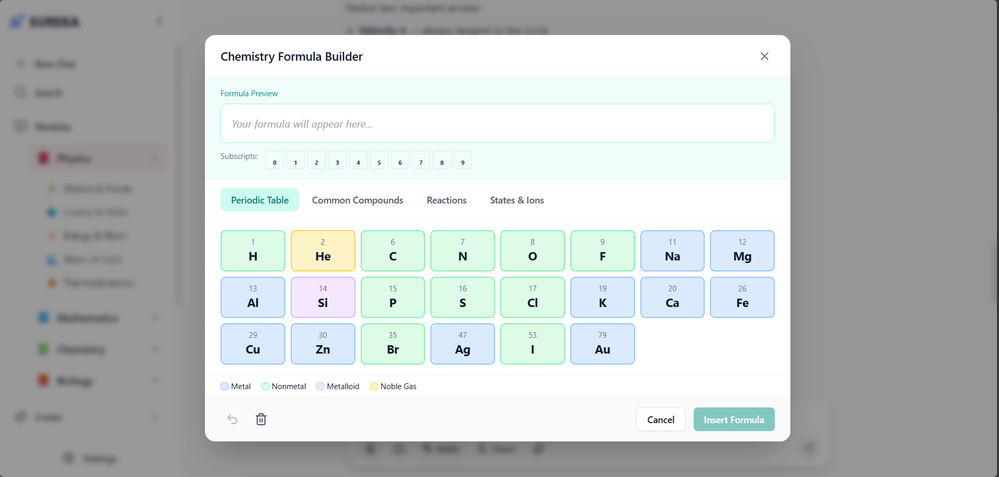

### 2. Module Concept Map

Structured node-based curriculum architecture.

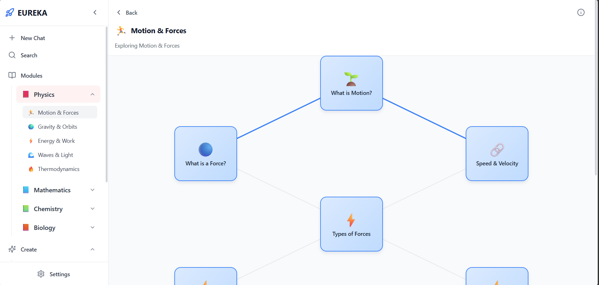
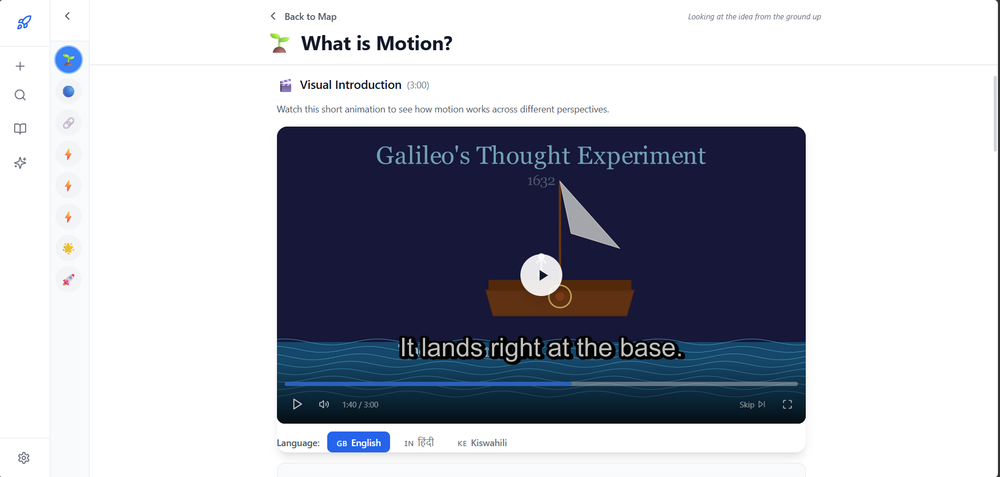
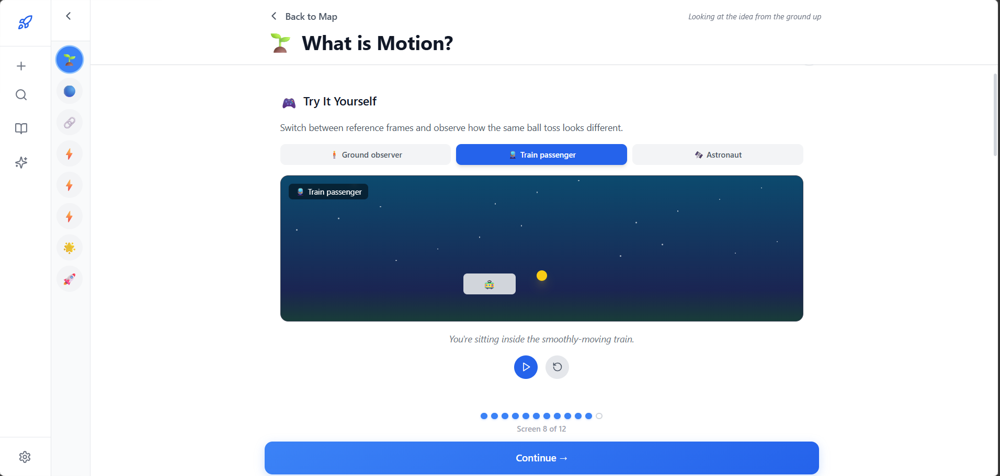

### 3. Custom Module Builder

Teacher-assisted module generation with safeguarded cognitive layer.

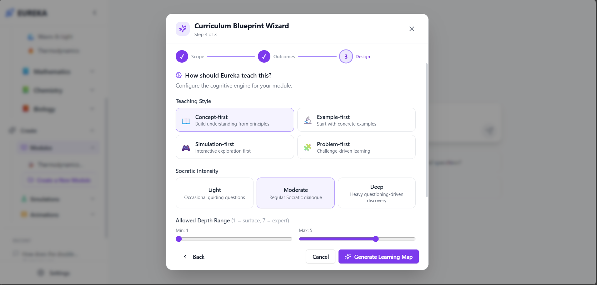
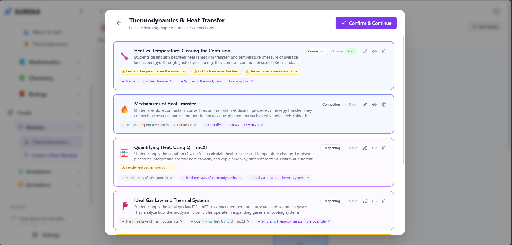
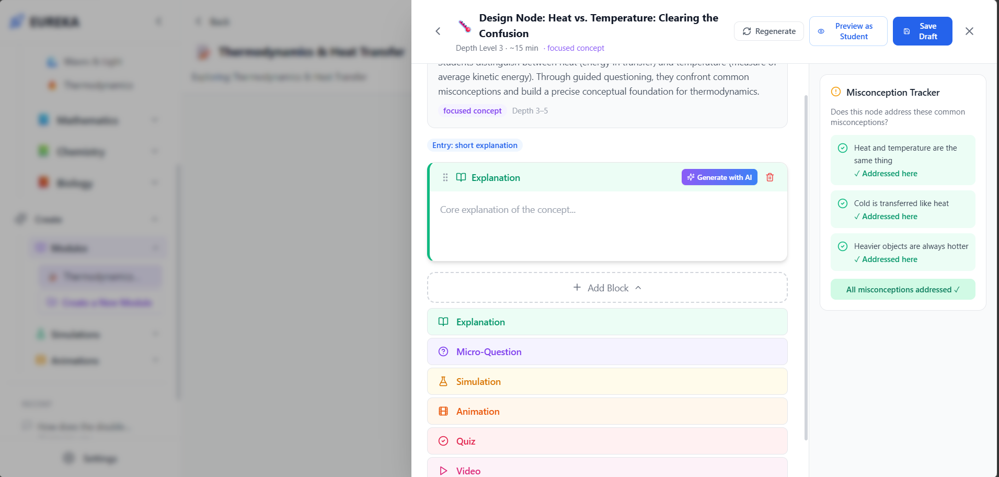

### 4. Simulation Builder

Interactive simulation configuration and runtime view.

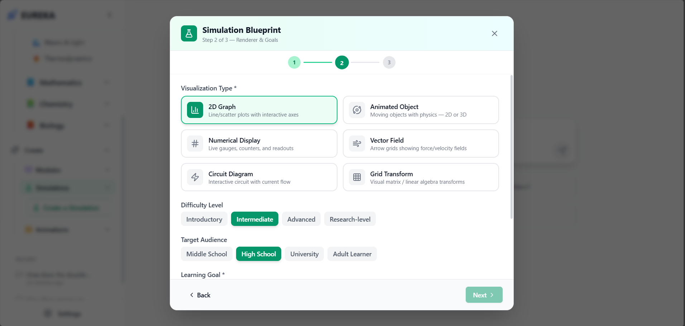
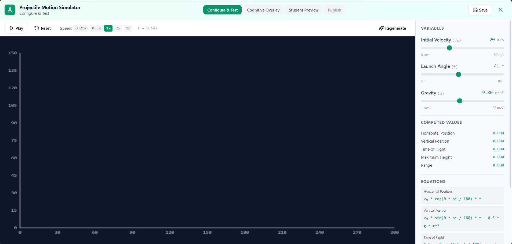

### 5. Animation Builder

Conceptual animation creation and integration workflow.

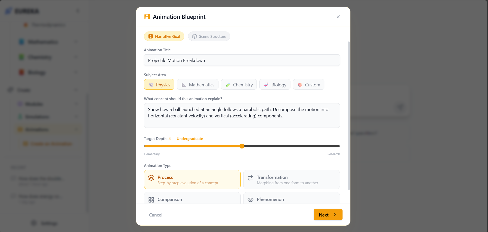
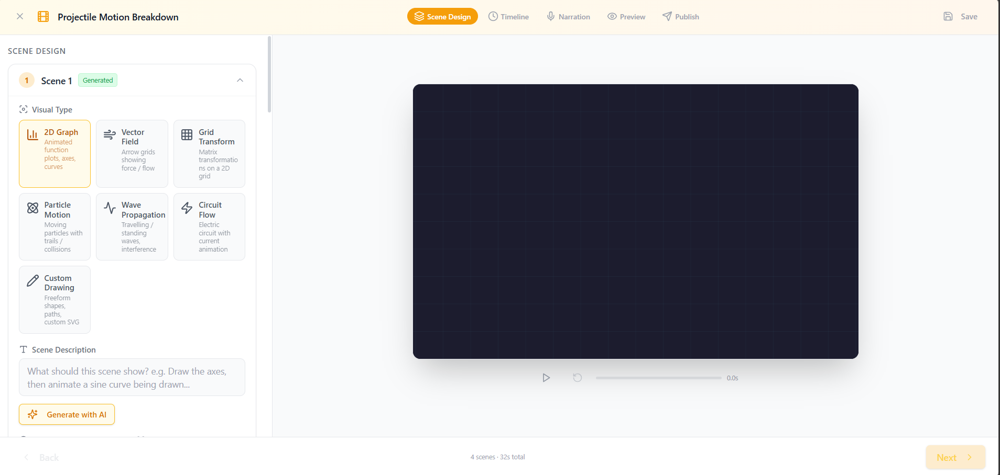

---

## Local Development Setup

### Prerequisites

- Node.js >= 18
- Python >= 3.12
- MongoDB (local or connection string)

### Frontend

```bash
git clone <repository-url>
cd eureka
npm install
npm run dev
```

The Vite dev server starts on `http://localhost:5173` and proxies `/api` requests to the backend.

### Backend

```bash
cd backend
python -m venv .venv
.venv\Scripts\Activate.ps1        # Windows
# source .venv/bin/activate       # macOS / Linux
pip install -r requirements.txt
```

Create a `.env` file from the template:

```bash
cp .env.example .env
```

Configure the required environment variables (API keys for Azure OpenAI, Azure Speech, Google AI services, and MongoDB connection string). Do not commit `.env` to version control.

Start the server:

```bash
uvicorn main:app --reload --port 8000
```

---

## Design Principles

- **Dignity before difficulty.** No student should feel diminished for not understanding.
- **Adaptation before correction.** Meet the student where they are.
- **Challenge with consent.** Intellectual provocation is gated behind readiness verification.
- **Consistency over novelty.** The system holds itself accountable to what it has previously taught.
- **Transparency of cognition.** Every pedagogical decision has a traceable computational source.
- **Teacher agency.** Educators control curriculum structure; AI handles generation within those constraints.
- **Safety as infrastructure.** Dignity enforcement cannot be disabled.

---

## Future Directions

- Embedding-based RAG retrieval
- Multi-student classroom analytics dashboard
- Collaborative learning sessions
- Additional knowledge base modules
- Exportable curriculum packages
- Mobile-responsive layout optimization

---

## License

MIT License

Copyright (c) 2026 Abhay Singh

Permission is hereby granted, free of charge, to any person obtaining a copy
of this software and associated documentation files (the "Software"), to deal
in the Software without restriction, including without limitation the rights
to use, copy, modify, merge, publish, distribute, sublicense, and/or sell
copies of the Software, and to permit persons to whom the Software is
furnished to do so, subject to the following conditions:

The above copyright notice and this permission notice shall be included in all
copies or substantial portions of the Software.

THE SOFTWARE IS PROVIDED "AS IS", WITHOUT WARRANTY OF ANY KIND, EXPRESS OR
IMPLIED, INCLUDING BUT NOT LIMITED TO THE WARRANTIES OF MERCHANTABILITY,
FITNESS FOR A PARTICULAR PURPOSE AND NONINFRINGEMENT. IN NO EVENT SHALL THE
AUTHORS OR COPYRIGHT HOLDERS BE LIABLE FOR ANY CLAIM, DAMAGES OR OTHER
LIABILITY, WHETHER IN AN ACTION OF CONTRACT, TORT OR OTHERWISE, ARISING FROM,
OUT OF OR IN CONNECTION WITH THE SOFTWARE OR THE USE OR OTHER DEALINGS IN THE
SOFTWARE.
